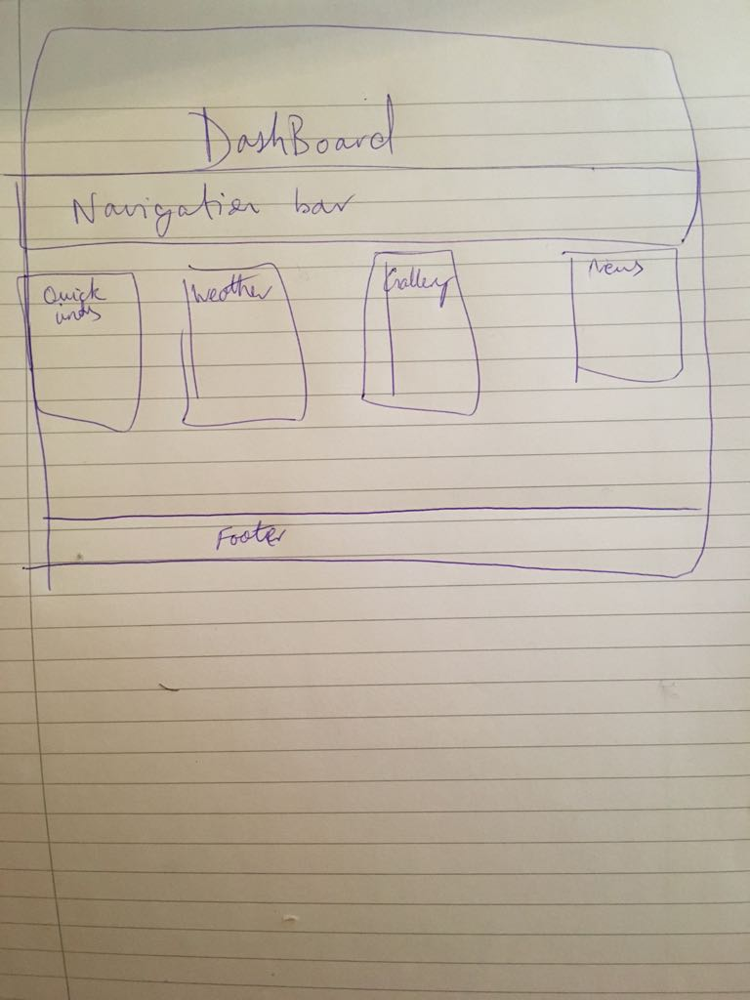

# CTEC3905 - Website

Please Note: There seems to be an issue with the APIs I used and github pages. The API call is not secure even over https which is confusing (API being weather data from the MET office). The work around for this is using a http call which seems to work but not on gitHub Pages :(. For the best experience download the project.

# Design

My Website is a Dashboard/Homepage that I can use. As such I wanted to make sure that the page is single page application, due to the nature of the site. The site will only have my attention for a mintue at max whilst I navigate to another page. Here is a quick sketch of what I planned to create at the begining

As you can see the design seemed to change during development. This was done to make sure the end product is fit for purpose, as some of the things that I initially thought would be good to add was not.

One example of this was the Gallery tile, which was replaced to the Quote tile. I realised that the whole page could be a gallery of fresh images rather than one tile. To accomplish this I made the background random on every page load thanks to https://source.unsplash.com

# Resources

background images: https://source.unsplash.com

All the code for this project was hand written although there was one useful youtube tutorial that helped create the paralax effect: https://www.youtube.com/watch?v=JttTcnidSdQ&t=794s

API's used for weather: https://www.metoffice.gov.uk/datapoint/getting-started

API for quotes:
https://forismatic.com/en

